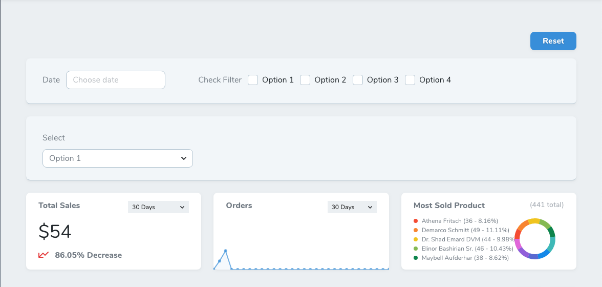

# Nova Global Filter

This package allows you to emit any of your existing Laravel Nova filters to metrics or custom cards.


## Installation

You can install the package in to a `Laravel` app that uses [Nova](https://nova.laravel.com) via composer:

```bash
composer require nemrutco/nova-global-filter
```

## Usage

In this example, we are registering few `Metric Cards` and the `Global Filter` with a `Date` filter as:

```php
...
use Nemrutco\NovaGlobalFilter;
use App\Nova\Filters\Date;

class Store extends Resource
{
  ...
  public function cards(Request $request)
  {
    return [
      new TotalSales // Value Metric

      new Orders, // Trend Metric

      new MostSoldProduct, // Partition Metric

      // NovaGlobalFilter
      new NovaGlobalFilter([
        new Date, // Date Filter
      ]),
    ];
  }
  ...
}
```

And now `metric cards` or any `other cards` optimized to listen `GlobalFilter` can be filtered by using `GlobalFilterable` trait and calling `$this->globalFiltered($model,$filters)` method.

`globalFiltered($model, $filters = [])` method expect `$model` and `$filters` parameters:

```php
use Nemrutco\NovaGlobalFilter\GlobalFilterable;
use App\Nova\Filters\Date;
...

class UsersPerDay extends Trend
{
use GlobalFilterable;

  public function calculate(NovaRequest $request)
  {
    // Filter your model with existing filters
    $model = $this->globalFiltered(Store::class,[
      Date::class // DateFilter
    ]);

    // Do your thing with the filtered $model
    return $this->countByDays($request, $model);

  }
...
}
```

And that's it. Cards will be filtered based on passed filter value.

To change layout from `grid` to `inline`

*by default it's set to `grid`*



```php
...
new NovaGlobalFilter([
    // Filters
])->inline(),
...
```

To enable `Reset` button
```php
...
new NovaGlobalFilter([
    // Filters
])->resettable(),
...
```

To add multiple `Global Filter`s
```php
...
new NovaGlobalFilter([
    // Filters
])->inline()->resettable(),

new NovaGlobalFilter([
    // Filters
])->onlyOnDetail(),
...
```

To listen `Global Filter` on any `Custom Card`s:

```js
...
created() {
  Nova.$on("global-filter-changed", filter => {
    // Do your thing with the changed filter
    console.log(filter);
  });
},
...
```

## Good to know

- Basic functionality of this package is that it listens all the asigned filters. Once a value of a filter is changed, it emits as `Nova.$on('global-filter-changed', [changed filter and value])`. So any card that listens to this event will recieve the filter and its value.
- This package overwrites Nova's default `Metric Card`s to allow them to listen `"global-filter-changed"` event. Make sure there are no any conflicts with other pacages.
- This package currently does not support Index view filters to be synchronized. So filters in `Global Filter` will not trigger update at the filters in `Filter Menu` of your Index view.
- `Reset` button simply reloads the current page. There is nothing fancy going on behind the scenes.
- If you are willing to support this package, it will be great to get your issues, PRs and thoughts on [Github](https://github.com/nemrutco/). And dont forget to `Star` the package.

Cheers

## Credits

- [Muzaffer Dede](https://github.com/muzafferdede)
- [All Contributors](../../contributors)

## License

The MIT License (MIT). Please see [License File](LICENSE.md) for more information.
